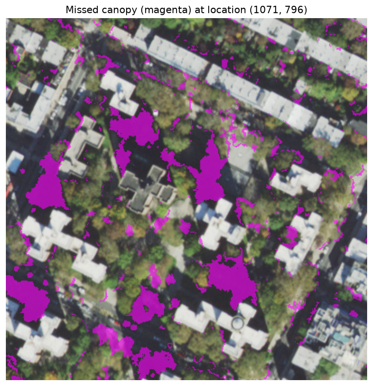
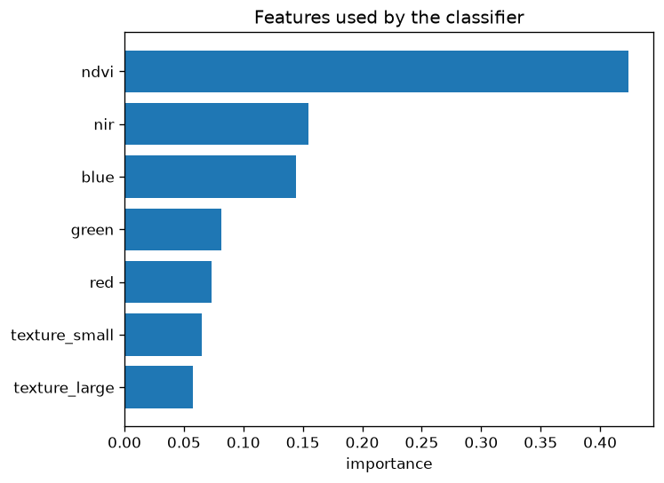
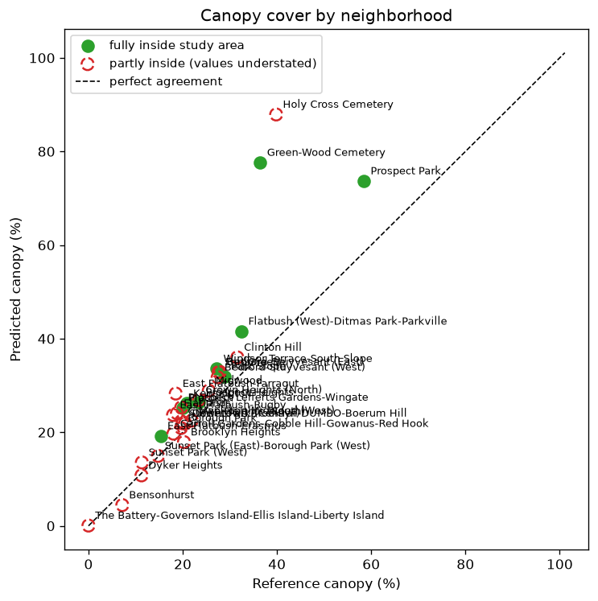

Readme · MD
# Tree Canopy Classification from Aerial Imagery
 
This project examines whether ordinary aerial photography can be used to estimate
tree canopy cover in Brooklyn, New York. Canopy is typically mapped using LiDAR,
which is accurate but expensive and infrequently repeated. An important aspect of
this work is to determine how closely a classifier trained on aerial imagery can
approximate a LiDAR-derived reference, and to identify why a simpler spectral
method fails. Furthermore, the results could support canopy monitoring in years
when LiDAR data is unavailable.
 
[Live map](https://geobrec.github.io/canopy-remote-sensing/)
 

 
## Data
 
| | Source | Resolution | Date |
|---|---|---|---|
| Imagery | USDA NAIP, RGB and near-infrared | 0.6 m | 5 Nov 2021 |
| Reference | NYC land cover, LiDAR-derived | 0.15 m | 2021 |
| Boundaries | NYC Neighborhood Tabulation Areas | | 2020 |
 
The study area covers approximately 6.0 x 7.7 km of Brooklyn, including Prospect
Park, and was divided into 1,911 tiles of 256 x 256
pixels. Tree canopy covers 24.5% of the study area in the reference data. The
reference data was resampled onto the imagery grid using majority resampling, as
the land cover classes are categorical. The tiles were then divided by geographic
position, with 1,127 used for training, 392 for validation, and 392 for testing.
A random split was avoided because neighboring tiles share trees and lighting
conditions, which would inflate the results.
 
## NDVI Baseline
 
A single NDVI threshold was selected on the training tiles by maximizing the F1
score and then applied unchanged to the test tiles. The selected threshold was
-0.02, and the method reached an IoU of 0.474, with a precision of 0.614 and a
recall of 0.676.
 

 
The NDVI distributions of tree canopy and grass overlapped substantially, so no
single threshold could separate the two. Moreover, a portion of the canopy
produced negative NDVI values, which healthy vegetation does not typically
produce. The cause of both errors was examined in the investigation below.
 
## Investigation
 
The errors of the NDVI baseline were examined in two groups: false alarms, in
which non-canopy was classified as canopy, and missed canopy.
 
Grass and shrub accounted for 52.0% of the false alarms, as lawns share the
spectral response of tree canopy. However, paved surfaces, buildings, and roads
together accounted for a further 47.3%. These were admitted because the selected
threshold fell below zero, which was itself a consequence of the missed canopy
described below.
 
The missed canopy had a mean near-infrared value of 76.2, approximately half that
of detected canopy (147.9), and its blue reflectance was nearly equal to its red
(102.1 and 103.6), compared with 78.4 and 95.4 for detected canopy. Suppressed
near-infrared and relatively elevated blue are characteristic of shaded surfaces,
which are lit by diffuse skylight rather than direct sunlight. Visual inspection
confirmed that the missed canopy was concentrated in the shadows of buildings,
which are long under the low November sun. The imagery was also radiometrically
balanced during production, which likely explains why the shaded pixels were only
slightly darker than detected canopy.
 
Three further tests were conducted. First, between 77.4% and 81.0% of the missed
pixels at three locations were fully covered by canopy in the LiDAR data, while
only 7.2% - 8.6% lay on a canopy boundary. This excluded mixed pixels at crown
edges as the main cause. Second, a shift test compared the imagery and reference at
three locations. At the western and central locations, no shift improved IoU by
more than 0.014, but at the eastern location a shift of 4 pixels (2.4 m) to the
east raised IoU from 0.495 to 0.572. This pattern is consistent with relief
displacement. The imagery was captured by a pushbroom sensor and orthorectified
to a bare-earth elevation model, so elevated objects such as trees lean away from
the center of each flight strip. Realigning the eastern location reduced its
missed canopy rate from 29.4% to 22.5%, indicating that displacement accounted
for approximately a quarter of the misses where it was strongest.
 
Third, missed canopy was 15.6 percentage points more likely than detected canopy
to have a building within 24 m to its west, and 7.1 points more likely to the
south, while the north showed no difference. This is consistent with shadows cast
by a sun in the southwest, although the test tiles lie in the eastern part of the
study area, where relief displacement also places misses on the western side of
each crown.
 

 
In summary, the missed canopy was caused primarily by building shadow and
secondarily by relief displacement.
 
## Random Forest
 
The investigation informed the design of the classifier. All four spectral bands
were retained so that the signature of shaded canopy was preserved, and texture,
measured as local variance at two window sizes, was added to separate grass from
canopy. Two versions were trained on a random sample of 2 million pixels, one
using spectral features only and one adding texture.
 
| Method | IoU | Precision | Recall | F1 |
|---|---|---|---|---|
| NDVI threshold | 0.474 | 0.614 | 0.676 | 0.643 |
| Random Forest, color only | 0.488 | 0.649 | 0.663 | 0.656 |
| Random Forest, color and texture | 0.509 | 0.654 | 0.697 | 0.675 |
 
All results were measured on the same test tiles. Texture was retained on the
basis of the validation data, where it raised IoU from 0.547 to 0.578, and on the
test data it raised IoU from 0.488 to 0.509. The most important features were
NDVI, near-infrared, and blue. The prominence of blue is consistent with its role
in identifying shaded canopy.
 
The improvement over the NDVI baseline at the pixel level was modest. Neither
color nor local texture can fully distinguish shaded canopy from shaded pavement.
Additionally, errors caused by relief displacement arise from a mismatch between
the imagery and the reference rather than from the classifier, so no per-pixel
method can correct them.
 

 
## Neighborhood Results
 
| | Reference | NDVI threshold | Random Forest |
|---|---|---|---|
| Canopy fraction, full study area | 24.5% | 26.0% | 24.4% |
| Average error, 9 neighborhoods |-| +5.6 pp | +2.3 pp |
| Average size of error, 9 neighborhoods |-| 8.8 pp | 4.9 pp |
 
The improvement was considerably greater at the neighborhood scale than at the
pixel level. Across the full study area, the Random Forest estimated a canopy
fraction of 24.4%, against 24.5% in the reference, while the NDVI threshold
overestimated it at 26.0%. Of the 32 neighborhoods intersecting the study area,
9 were fully contained within it; the remainder were excluded, as the area
outside the study area has no prediction. Across these 9 neighborhoods, the
average size of the Random Forest's error was 4.9 percentage points, compared
with 8.8 for the NDVI threshold. This suggests that many of the pixel-level
errors offset one another within a neighborhood. The Random Forest overestimated
canopy most in Green-Wood Cemetery, by 25.2 percentage points, and Prospect Park,
by 6.7 percentage points. Both combine dense canopy with extensive lawns, which is
consistent with grass being classified as canopy, the main source of false alarms
identified in the investigation. Green-Wood Cemetery alone accounted for more than
half of the total error. Across the remaining 8 neighborhoods, the average size of
error was approximately 2.4 percentage points and the average error was close to
zero (approximately -0.6), indicating that the overall overestimate of +2.3 arose
almost entirely from the cemetery.
 

 
## Notebooks
 
| Notebook | Contents |
|---|---|
| [01 - Prepare data](notebooks/01_prepare_data.ipynb) | Alignment and tiling |
| [02 - NDVI baseline](notebooks/02_ndvi_baseline.ipynb) | Data split and baseline |
| [02b - Investigation](notebooks/02b_investigation.ipynb) | Causes of the NDVI errors |
| [03 - Random Forest](notebooks/03_random_forest.ipynb) | Features, model, and feature importance |
| [04 - Results](notebooks/04_results_and_map.ipynb) | Neighborhood totals and map |
 
## Limitations
 
Although the Random Forest improved on the NDVI baseline, there are a few
drawbacks and assumptions. The analysis uses a single study area and a single
acquisition date in November, when building shadows are long, so it does not
demonstrate that the results apply to other locations or seasons. The reference
data is itself a model, reported at approximately 99% accuracy for canopy, and
relief displacement means that the imagery and reference do not align for
elevated objects across the full study area. Additionally, the neighborhood
comparison rests on 9 neighborhoods, and the predictions used to calculate it
include the training tiles, so it is less strict than the pixel-level scores,
which use held-out test tiles only. Finally, each pixel is classified
independently, without consideration of crown shape.
 
## Future Work
 
This work could be extended to summer imagery, when a higher sun casts shorter
shadows, to determine how much of the NDVI baseline's error is seasonal. Relief
displacement could be reduced by using true orthophotos or a correction based on
a surface model derived from the LiDAR data. Furthermore, the method could be
applied to other cities where reference canopy data is available, or combined
with the 2017 - 2021 canopy change data to examine where canopy has been lost.
 
## Reproducing the Analysis
 
```bash
conda env create -f environment.yml
conda activate canopy
python -m ipykernel install --user --name canopy
```
 
Create the folders data/raw, data/interim/chips, data/processed, figures, and
docs. In VS Code, select the canopy interpreter as well as the Python (canopy)
notebook kernel. Download the land cover data from
[Zenodo](https://zenodo.org/records/14053441), a NAIP 2021 tile, and the NYC 2020
Neighborhood Tabulation Areas into data/raw, using the file names listed in
src/config.py. The notebooks should then be run in order: 01, 02, 02b, 03, and
04.
 
## License
 
The code is released under the MIT License. The derived data and map are released
under CC BY-NC-SA 4.0, inherited from the land cover data. See
[DATA_LICENSE.md](DATA_LICENSE.md).
 
