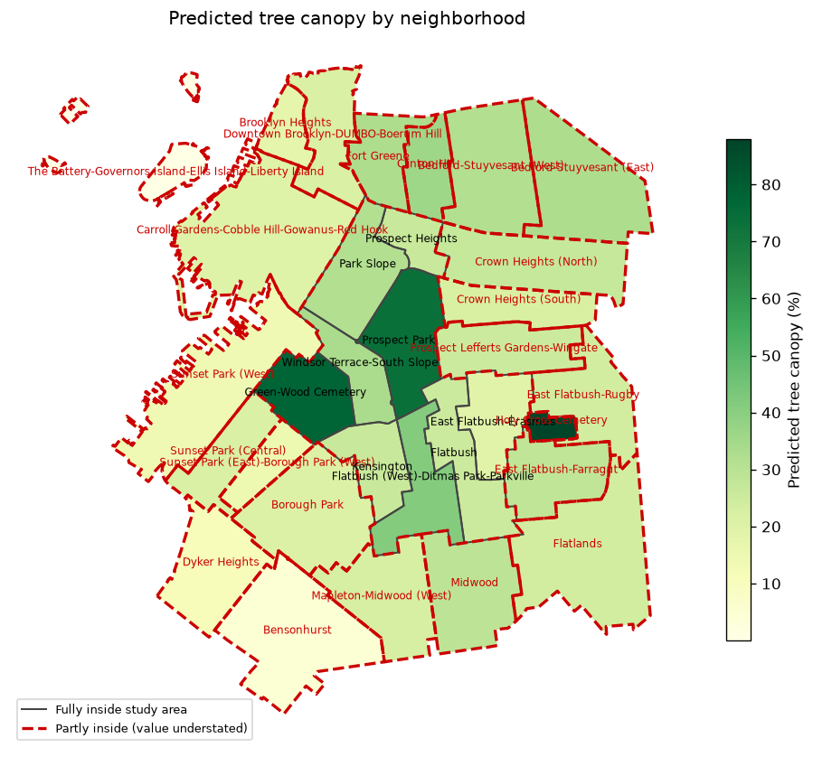
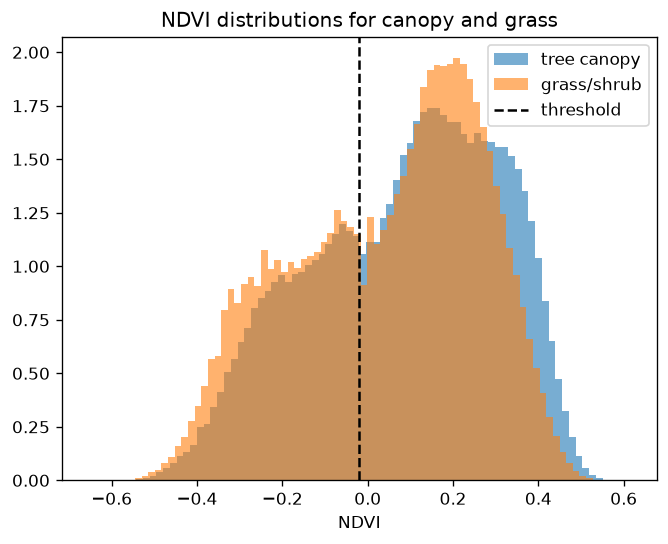

# Tree Canopy Classification from Aerial Imagery

This project examines whether ordinary aerial photography can be used to estimate
tree canopy cover in New York City. Canopy is typically mapped using LiDAR, which
is accurate but expensive and infrequently repeated. An important aspect of this
work is to determine how closely a model trained on aerial imagery can
approximate a LiDAR-derived reference, and where it fails. Furthermore, the
results could be used to support canopy monitoring in years when LiDAR data is
unavailable.

[Live map](https://geobrec.github.io/canopy-remote-sensing/)



## Data

| | Source | Resolution | Date |
|---|---|---|---|
| Imagery | USDA NAIP, RGB and near-infrared | 0.6 m | 5 Nov 2021 |
| Reference | NYC land cover, LiDAR-derived | 0.15 m | 2021 |
| Boundaries | NYC Neighborhood Tabulation Areas |-| 2020 |

The reference data was derived from LiDAR and therefore measures height rather
than reflected light. As a result, the model is not simply reproducing
information already contained in its input. The study area covers
Park Slope, Brooklyn, measuring approximately 6.0 x 7.7 km and divided into
1911 tiles.

## Method

The reference data was first resampled onto the NAIP pixel grid using majority
resampling, as the land cover classes are categorical. The tiles were then
divided by geographic position, with 60% used for training, 20% for validation,
and 20% for testing. A random split was avoided because neighboring tiles share
trees and lighting conditions, which would inflate the results.

Two methods were compared. The first applied a single NDVI threshold tuned on the
training data. The second was a Random Forest classifier using seven features per
pixel: the four spectral bands, NDVI, and local variance measured at two window
sizes.

## Results

| Method | IoU | Precision | Recall |
|---|---|---|---|
| NDVI threshold | 0.474 | 0.614 | 0.676 |
| Random Forest | 0.511 | 0.582 | 0.806 |

The Random Forest improved IoU from 0.474 to 0.511. When the texture features
were removed, IoU decreased to [x.xx], indicating that surface texture accounts
for much of the improvement. Across the 9 neighborhoods fully contained within
the study area, predicted canopy was within 10.3 percentage points of the
reference.



The imagery was collected on 5 November 2021, when a portion of the canopy had
changed color while grass remained green. Consequently, canopy NDVI values were
bimodal and overlapped those of grass, and no single threshold could separate the
two.

Moreover, the canopy missed by NDVI showed near-infrared values lower than red,
which vegetation does not produce. A shift test ruled out misalignment between
the datasets. Of the canopy missed by NDVI, 46.1% lay within 2 pixels of a crown
edge, compared with 21.0% of the canopy it detected. Mixed pixels, in which a
0.6 m pixel at a crown edge records the average of leaves and pavement, therefore
account for a substantial share of the misses, and this effect is greatest for
narrow street trees. However, more than half of the missed canopy lay within
crown interiors, which is consistent with foliage that had changed color by
November.

## Notebooks

| Notebook | Contents |
|---|---|
| [01 - Prepare data](notebooks/01_prepare_data.ipynb) | Alignment and tiling |
| [02 - NDVI baseline](notebooks/02_ndvi_baseline.ipynb) | Data split, baseline, and error analysis |
| [03 - Random Forest](notebooks/03_random_forest.ipynb) | Features, model, and feature importance |
| [04 - Results](notebooks/04_results_and_map.ipynb) | Neighborhood totals and map |

## Limitations

Although the results show a clear improvement over the NDVI baseline, there are a
few drawbacks and assumptions. The analysis uses a single study area and a single
acquisition date, so it does not demonstrate that the model generalizes to other
locations or seasons. The reference data is itself a model, reported at
approximately 99% accuracy for canopy. Additionally, each pixel is classified
independently without consideration of crown shape, and mixed pixels limit
accuracy for narrow street trees at this resolution.

## Future Work

This work could be extended to leaf-on imagery to determine whether the NDVI
baseline recovers in summer conditions. It could also be applied to other cities
where reference canopy data is available, or combined with the 2017 - 2021 canopy
change data to examine where canopy has been lost.

## Reproducing the Analysis

```bash
conda env create -f environment.yml
conda activate canopy
python -m ipykernel install --user --name canopy
```

Create the folders data/raw, data/interim/chips, data/processed, figures, and
docs. In VS Code, select the canopy interpreter as well as the Python (canopy)
notebook kernel. Download the land cover data from
[Zenodo](https://zenodo.org/records/14053441), a NAIP 2021 tile, and the NYC 2020
Neighborhood Tabulation Areas into data/raw, using the file names listed in
src/config.py. The notebooks should then be run in order from 01 to 04.

## License

The code is released under the MIT License. The derived data and map are released
under CC BY-NC-SA 4.0, inherited from the land cover data. See
[DATA_LICENSE.md](DATA_LICENSE.md).